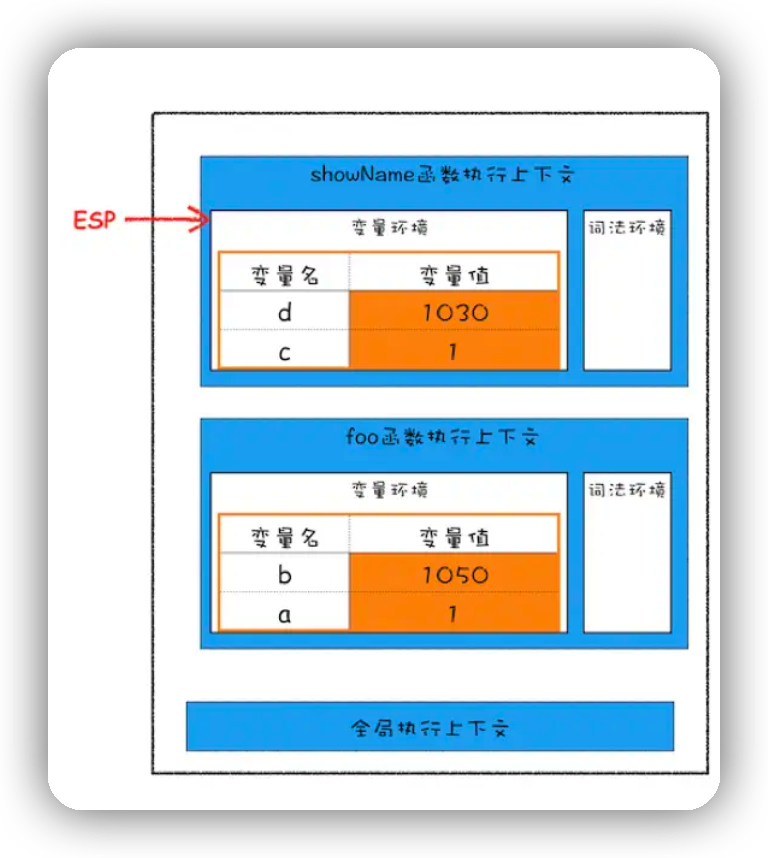

# JS的垃圾回收机制

众所周知,js的数据分为基本类型和引用类型.

基本类型保存在栈内存,引用类型保存在堆内存.

不同的内存有不同的回收机制

## 栈内存的数据回收

```js
function foo() {
  var a = 1
  var b = { name: 'xiaoci1' }
  function foo2() {
    var c = 2
    var d = { name: 'xiaoci2' }
  }
  foo2()
}
foo()
```



栈空间用来存放执行上下文,全局定义的基本变量在栈底的全局执行上下文中,不会出栈.在页面关闭时才会弹出销毁.

而函数执行上下文会在执行代码的过程中，如果遇到函数的主动调用，就会生成一个函数执行上下文，**入栈**到函数调用栈中；当函数调动完成之后，就会执行出栈操作.

在函数执行栈的过程中,会有一个记录当前执行状态的指针（称为 ESP）,指向调用栈中 **当前** 函数的执行上下文，表示当前正在执行当前函数.

在当前函数执行完之后,函数执行流程就进入了下一个函数的执行,同时ESP下移,当前的函数执行上下文失效.当有新的函数被调用时,创建新的函数执行上下文,入栈,覆盖掉失效的.

***JavaScript 引擎会通过向下移动 ESP 来销毁该函数保存在栈中的执行上下文***

## 堆内存的数据回收


